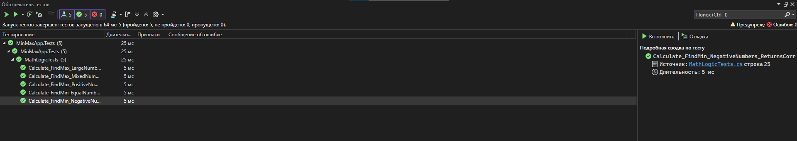

# Лабораторная работа: Тестирование WPF-приложения
**Студент:** Третьяк Егор Николаевич
**Вариант:** №11  

## Описание задания
Разработать приложение на платформе WPF для нахождения максимума или минимума из трех вещественных чисел. В проекте реализовано разделение логики и интерфейса, добавлены XAML-комментарии и автоматизированные Unit-тесты.

## Технологический стек
* C# / .NET
* WPF (Windows Presentation Foundation)
* MSTest (для автоматизированного тестирования)

## Результаты тестирования
Приложение прошло полное покрытие Unit-тестами. Все 5 сценариев завершились успешно.

### Скриншот Обозревателя тестов
